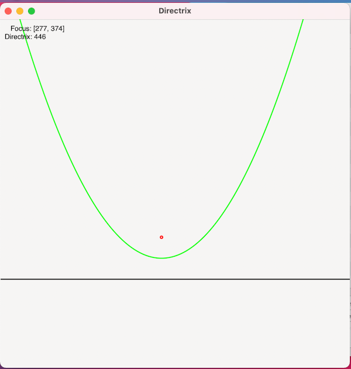

# directrix

directrix is a Rust GTK+ application that is a first step in a voronoi diagram based map generator. This application demonstrates some basic Rust GTK+ capabilities necessary for more full featured application. This application is a good place to start if you want to understand the voronoi diagram or simple map generation applications.

## Building

You will need the GTK+ development libraries installed to build directrix.

### OSX
Using homebrew on OSX you can install the gtk+ development libraries using

    brew install gtk+

Once you have installed the gtk+ libraries you should be able to build with 

    cargo run

or

    cargo run --release

You should see a GTK+ application window with the directrix based parabola:

Clicking in the window will change the location of the focus and moving the mouse pointer will change the location of the directrix.